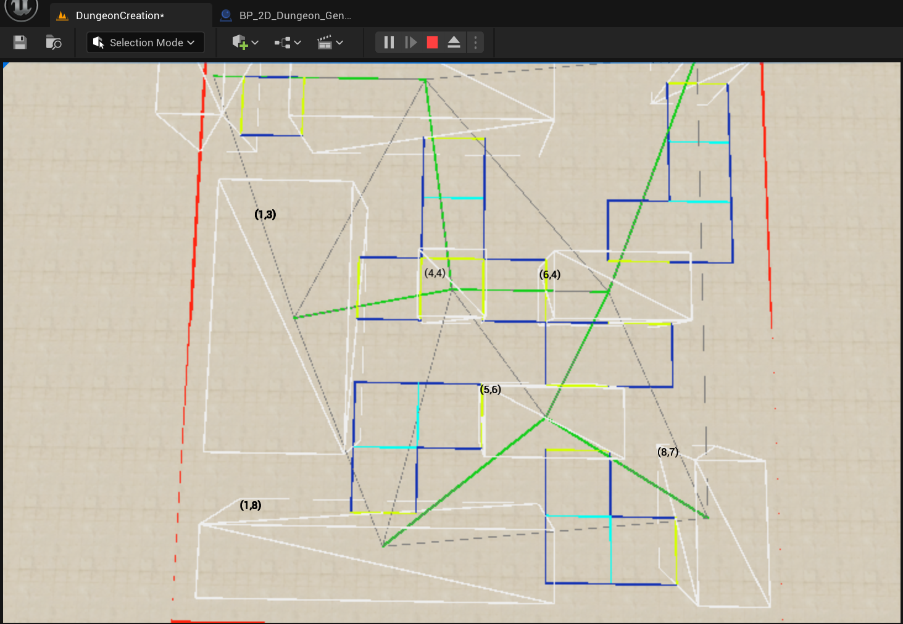
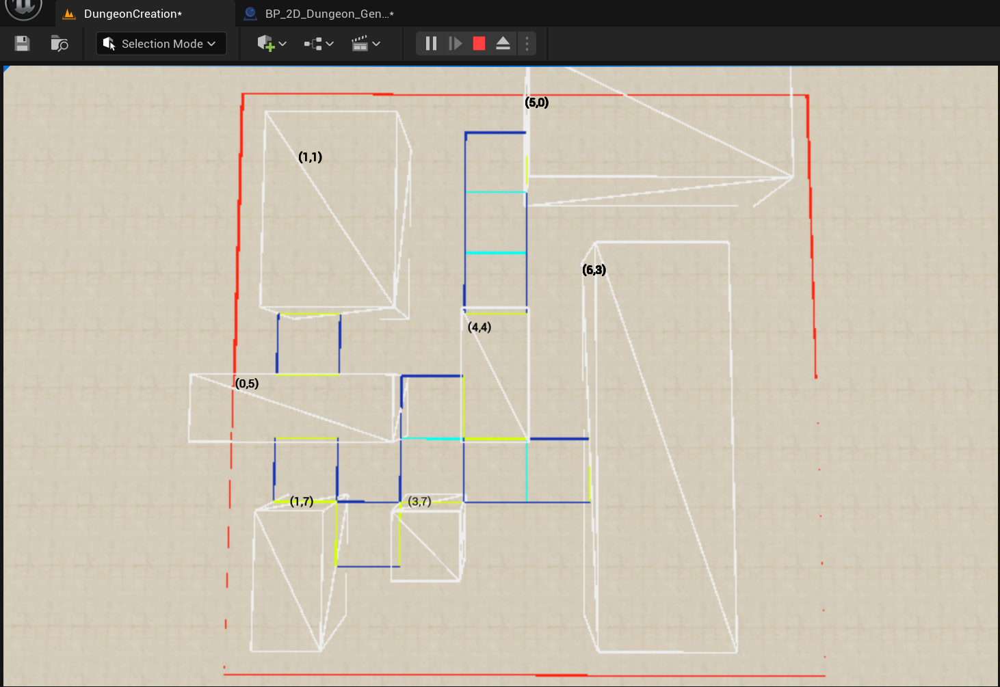
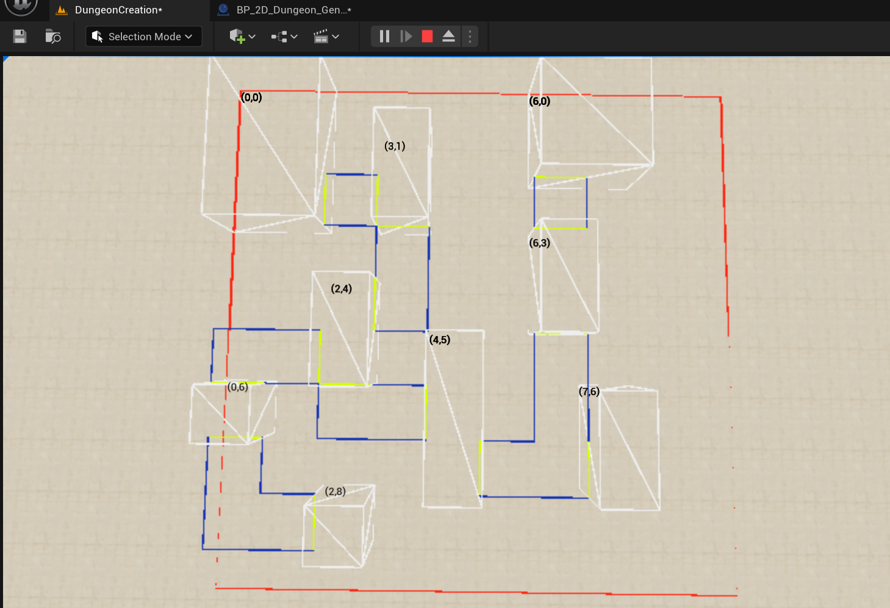

# 🏰 Procedural Dungeon Generator — Unreal Engine 5
A procedural dungeon generator built in Unreal Engine 5 with the goal of moving all generation logic to a Go-based backend server.
This project is part of my journey to learn, have fun creating something I like, and showcase my engineering skills.

## 📖 Overview
- This project generates procedurally created dungeons with:
- Non-overlapping rooms with buffer zones
- Delaunay triangulation to connect rooms
- Minimum Spanning Tree for efficient pathways
- A Pathfinding* to carve hallways cell-by-cell
- Grid-based cell type classification (Room, Hallway, Empty)

Currently, the generation logic is fully inside UE5 Blueprints for rapid prototyping and visual debugging.
The next phase will move all logic to a dedicated Go server and send only the final dungeon data to UE5 for rendering.

## ⚙️ Algorithms Used
I used https://github.com/vazgriz/DungeonGenerator as starting point, here shows you how to do it inside Unity3D. 
I decided to use Unreal in order to experiment and learn. The repository mentioned does not provide code to place assets,
considering that I created a grid based system that generates each part of the dungeon with a specific type that 
will enable the rendering of each section with a specific asset.

### 1. Room Placement
- Randomly positions rooms inside a grid
- Adds a buffer zone to avoid overlapping rooms 
- Ensures all rooms are fully inside the dungeon bounds

### 2. Delaunay Triangulation
- Connects all room centers with a triangle mesh
- Avoids narrow triangles, producing cleaner graph layouts

### 3. Minimum Spanning Tree (Prim’s Algorithm)
- Picks the shortest possible edges to connect all rooms
- Eliminates redundant paths for cleaner level design

### 4. A* Pathfinding
- Finds the shortest path between two rooms through the grid
- Supports diagonal movement
- Cost is adjusted based on terrain type:
  - Room → Higher cost to avoid overwriting rooms
  - Hallway → Low cost for shared paths
  - Empty → Default cost

### 5. Generate a unique grid
- Creates a grid in witch coordinate determines the type of cell
- Each type represent a different asset to render
- The algorithm consideres overlapping hallways, that creates interesting paths

## 📸 Screenshots
I use debug lines of different colors to represent each section of the dungeon:
- Red lines <span style="display: inline-block; width: 10px; height: 10px; background-color: red;"></span>: Dungeon limit 
- White boxes <span style="display: inline-block; width: 10px; height: 10px; background-color: white;"></span>: Rooms 
- Blue lines <span style="display: inline-block; width: 10px; height: 10px; background-color: blue;"></span>: Hallway Walls 
- Yellow lines <span style="display: inline-block; width: 10px; height: 10px; background-color: yellow;"></span>: Doors 
- Cyan lines <span style="display: inline-block; width: 10px; height: 10px; background-color: cyan;"></span>: Hallway paths 
- Gray lines <span style="display: inline-block; width: 10px; height: 10px; background-color: gray;"></span>: Delaunay Triangulation
- Green lines <span style="display: inline-block; width: 10px; height: 10px; background-color: lightgreen;"></span>: MST(Minimum Spanning Tree)

### All debug lines

### Just grid lines (Doors, Rooms, Hallway walls and Hallway paths)

### Just rooms and hallways (No hallway paths)


## 🚀 How to Run
### Prerequisites
- Unreal Engine 5 (latest version tested: 5.3+)
- Git

### Steps
```
git clone https://github.com/yourusername/procedural-dungeon-ue5.git
# Open .uproject in Unreal Engine 5
# Play in editor to see dungeon generation
```

## 🔮 Next Steps
- Move generation logic to Go backend server
- Implement network protocol to send dungeon data to UE5
- Replace debug meshes with modular dungeon art assets
- Add multiplayer sync for co-op dungeon runs

## 📬 Contact
If you have ideas, feedback, or just want to talk about procedural generation,
feel free to connect with me on LinkedIn or open an issue in this repo.